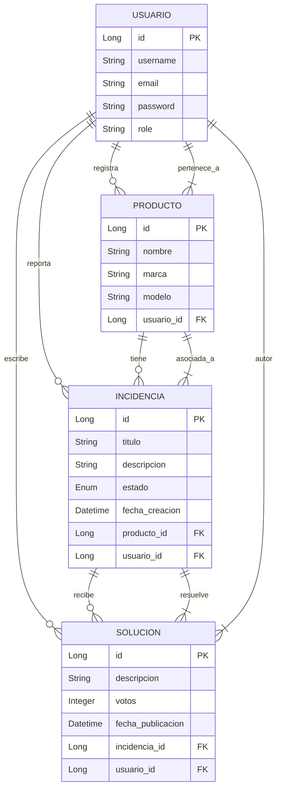

# Plataforma de Reparaciones Colaborativa - API REST

Este proyecto implementa una API RESTful para una comunidad de reparaciones. Permite a los usuarios registrar sus productos, reportar incidencias sobre los mismos y recibir u ofrecer soluciones de otros miembros de la comunidad.

---

## 1. 🛠️ Instalación y Ejecución

> **Nota:** Este servidor está configurado para ejecutarse en un entorno local siguiendo estos pasos, sin necesidad de configuración adicional compleja.

### Prerrequisitos
* **Java JDK**: Versión 17 o superior.
* **Gestor de Dependencias**: Maven (incluido mediante wrapper `mvnw`).
* **Base de Datos**: MySQL (o Docker con imagen MySQL).

### Pasos para el despliegue local

1. **Clonar el repositorio:**
   ```bash
   git clone https://github.com/AdrianDiaz24/Proyecto-Intermodular-2DAW.git
   cd Proyecto-Intermodular-2DAW/backend
   ```

2. **Configurar Base de Datos:**
   * Crea una base de datos vacía llamada `reparaciones_db`.
   * Asegúrate de que las credenciales en `src/main/resources/application.properties` coincidan con tu entorno local:
     ```properties
     spring.datasource.url=jdbc:mysql://localhost:3306/reparaciones_db
     spring.datasource.username=tu_usuario
     spring.datasource.password=tu_contraseña
     spring.jpa.hibernate.ddl-auto=update
     ```

3. **Ejecutar la aplicación:**
   Usa el wrapper de Maven para limpiar, instalar y ejecutar:
   ```bash
   ./mvnw spring-boot:run
   ```

4. **Verificación:**
   * La API estará disponible en: `http://localhost:8080`

---

## 2. 🗂️ Modelo de Datos (Diagrama E/R)

El sistema gestiona la relación entre usuarios, sus dispositivos (productos) y el ciclo de vida de una reparación (incidencia -> soluciones).

> **Estructura Relacional:**
> * Un **Usuario** puede tener múltiples **Productos**, reportar múltiples **Incidencias** y proponer múltiples **Soluciones** (1:N).
> * Un **Producto** pertenece a un único Usuario y puede tener múltiples **Incidencias** (1:N).
> * Una **Incidencia** pertenece a un Producto y recibe múltiples **Soluciones** (1:N).



### Descripción de Entidades

| Entidad | Descripción |
|---------|-------------|
| **USUARIO** | Usuarios registrados en la plataforma. Pueden ser `USER` o `ADMIN`. |
| **PRODUCTO** | Dispositivos/productos registrados por los usuarios. |
| **INCIDENCIA** | Problemas reportados sobre un producto. Estados: `ABIERTA`, `RESUELTA`, `CERRADA`. |
| **SOLUCION** | Respuestas/soluciones propuestas por la comunidad para resolver incidencias. |

---

## 3. 📡 Endpoints de la API

### Usuarios
| Método | Endpoint | Descripción |
|--------|----------|-------------|
| `GET` | `/api/usuarios` | Obtener todos los usuarios |
| `GET` | `/api/usuarios/{id}` | Obtener usuario por ID |
| `POST` | `/api/usuarios` | Crear nuevo usuario |
| `PUT` | `/api/usuarios/{id}` | Actualizar usuario |
| `DELETE` | `/api/usuarios/{id}` | Eliminar usuario |

### Productos
| Método | Endpoint | Descripción |
|--------|----------|-------------|
| `GET` | `/api/productos` | Obtener todos los productos |
| `GET` | `/api/productos/{id}` | Obtener producto por ID |
| `POST` | `/api/productos` | Crear nuevo producto |
| `PUT` | `/api/productos/{id}` | Actualizar producto |
| `DELETE` | `/api/productos/{id}` | Eliminar producto |

### Incidencias
| Método | Endpoint | Descripción |
|--------|----------|-------------|
| `GET` | `/api/incidencias` | Obtener todas las incidencias |
| `GET` | `/api/incidencias/{id}` | Obtener incidencia por ID |
| `POST` | `/api/incidencias` | Crear nueva incidencia |
| `PUT` | `/api/incidencias/{id}` | Actualizar incidencia |
| `DELETE` | `/api/incidencias/{id}` | Eliminar incidencia |

### Soluciones
| Método | Endpoint | Descripción |
|--------|----------|-------------|
| `GET` | `/api/soluciones` | Obtener todas las soluciones |
| `GET` | `/api/soluciones/{id}` | Obtener solución por ID |
| `POST` | `/api/soluciones` | Crear nueva solución |
| `PUT` | `/api/soluciones/{id}` | Actualizar solución |
| `DELETE` | `/api/soluciones/{id}` | Eliminar solución |

---

## 4. 🛡️ Tecnologías Utilizadas

* **Java 17**
* **Spring Boot 3.2.0**
* **Spring Data JPA**
* **Spring Security** (opcional)
* **MySQL**
* **Lombok**
* **Maven**

---

